Лабораторная работа нацелена на демонстрацию концепции SRE, в том числе устранение неполадок в Kubernetes, контейнеризация Docker, ограничение скорости, отладка сети, системная трассировка и сканирование системы безопасности.

Первым делом была запущена виртуальная машина и выполнен git clone репозитория, который будет использоваться.
Командой ls -la можно просмотреть какие есть файлы для выполнения последующих частей лабороторной работы.

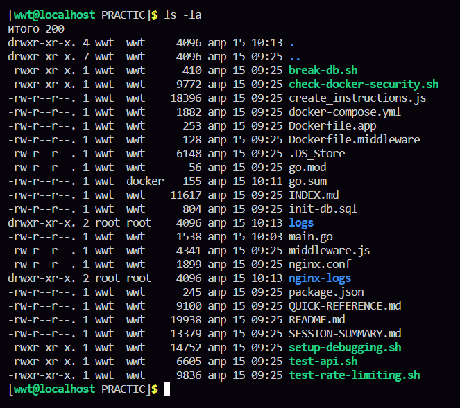

Командой docker-compose up -d были запущены контейнеры.

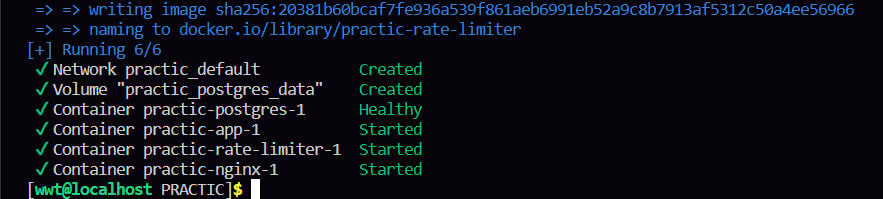

***
### Урок 1.

В первом уроке выполняется поднятие nginx и базовое тестирование через curl.
    
Сперва был проверен эндпоинт /health, что он доступен

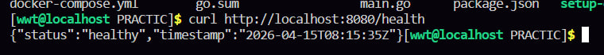

Затем просмотрены логи nginx - контейнер успешно запустился и работает. Нет никаких ошибок.

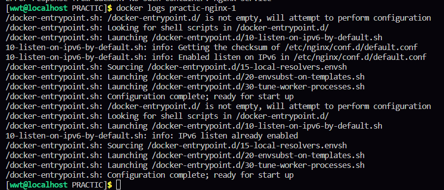

Сначала была использована команда docker logs nginx-service, но выдавалась ошибка, она возникла из-за того, что использовано неправильное имя. После смены имени на practic-nginx-1, все заработало, потому что в docker-compose up контейнеры запустились с префиксом practic-.

После выполнялось тестирование nginx.

    1. Получен ответ от сервера (статус, заголовки, тело ответа)

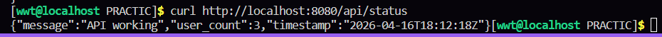

Был использован путь /localhost:8080/api/v1/status, но после выполнения была ошибка 404, чтобы её решить надо было заглянуть в файл main.go, где нет маршрута /api/v1/status, но есть /api/status без /v1, поэтому его и надо было использовать.

    2. Заголовок X-User-ID: 123 успешно передан серверу

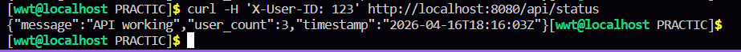

    3. Получено общее время выполнения запроса в секундах

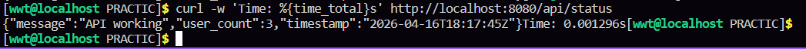

***
### Урок 2.

Целью одной из двух частей 2 урока является изучение основныx принципов безопасности Docker-контейнеров, научиться выявлять уязвимости в конфигурации и применять best practices для защиты контейнеризованных приложений.

При первом запуске скрипта check-docker-security.sh все контейнеры показывали критические ошибки.

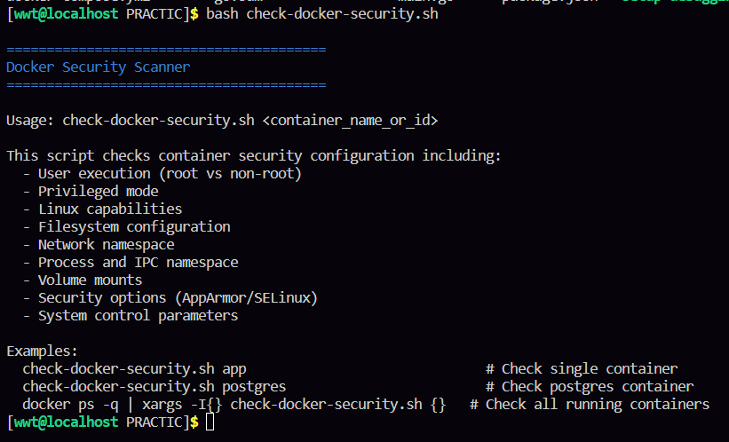

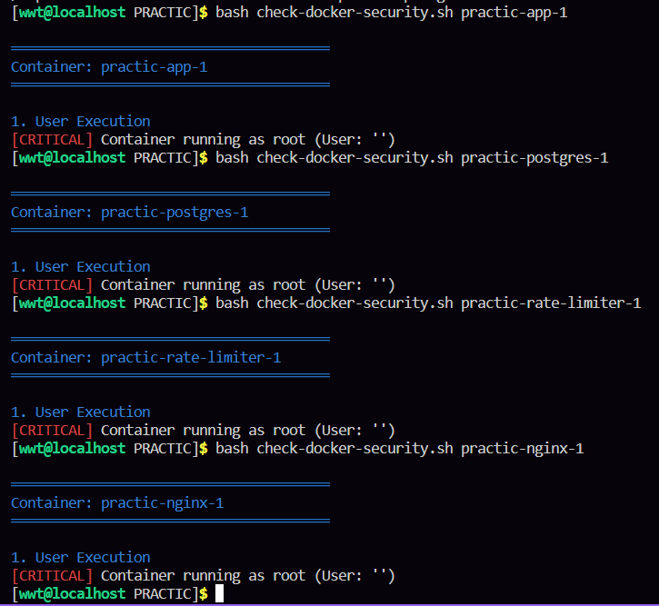

Запуск от root - если злоумышленник взломает приложение, он получит полный контроль над контейнером и потенциально над хост-системой.

Для исправления этого, были созданы обычные пользователи для запуска контейнеров, ограничены их права только самым необходимым, включен режим "только чтение" для системных файлов и настроены дополнительные механизмы защиты. В результате все проверки безопасности теперь проходят успешно, и контейнеры работают в безопасном режиме, что соответствует лучшим практикам Docker.

bash check-docker-security.sh practic-app-1

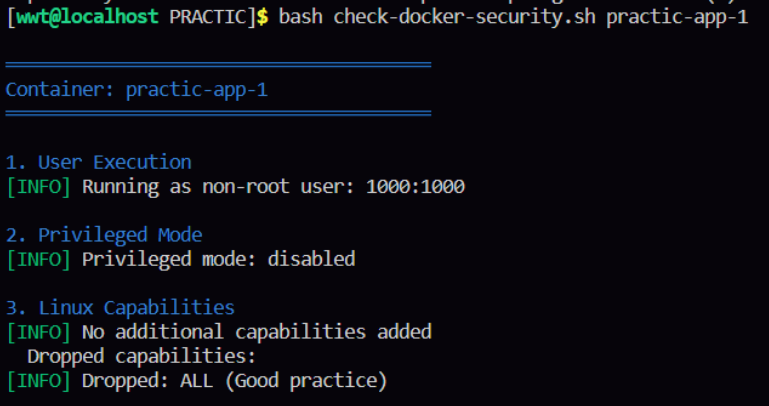

bash check-docker-security.sh practic-rate-limiter-1

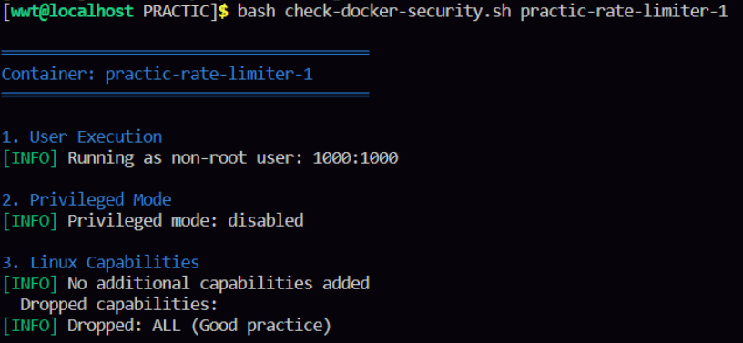

bash check-docker-security.sh practic-nginx-1

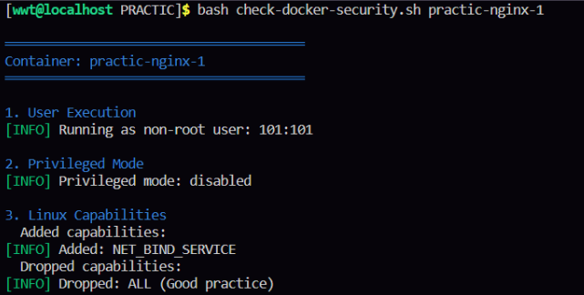

bash check-docker-security.sh practic-postgres-1

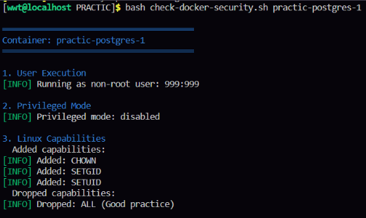

Все контейнеры теперь запускаются от non-root пользователей, имеют минимально необходимые capabilities, работают с read-only файловой системой и соответствуют практикам безопасности Docker, что подтверждается успешным прохождением всех проверок скриптом check-docker-security.sh.

Во второй части урока 2 изучается Multi-stage build.
Это техника, позволяющая создать минимальный и безопасный Docker-образ. Процесс разделяется на этапы: сначала компилируется приложение в "большом" образе со всеми инструментами, а затем копируется готовый бинарный файл в "чистый" финальный образ. В результате итоговый образ весит в 10–50 раз меньше, не содержит компиляторов и посторонних утилит, что ускоряет развертывание и повышает безопасность.

Для этого сначала существующий Dockerfile.app был переименован в Dockerfile.app.old, чтобы сохранить его. Затем создан новый обычный Dockerfile, который использует полный образ golang:1.21-alpine, устанавливает дополнительные инструменты (ca-certificates, curl, postgresql-client), копирует исходный код и компилирует приложение. После этого был собран обычный образ с тегом app:regular. Далее удален временный Dockerfile, возвращен обратно оригинальный multi-stage Dockerfile и собран оптимизированный образ с тегом app:multi-stage. Наконец, выполнена команда docker images | grep app, чтобы сравнить размеры полученных образов.

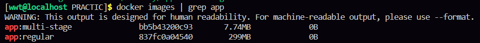

Вывод означает, что multi-stage образ меньше обычного почти в 40 раз. Обычный образ включает в себя Go компилятор, Alpine Linux, системные утилиты и исходный код, тогда как multi-stage образ содержит только скомпилированный бинарник, скопированный из промежуточного этапа сборки.

***
### Урок 3.

Целью первой части урока 3 является изучение алгоритма Token Bucket для ограничения частоты запросов (rate limiting), научиться тестировать его работу и анализировать результаты в JSON формате.

Для проверки работы rate limiter был выполнен скрипт. Этот скрипт автоматически отправляет серию запросов и анализирует ответы.

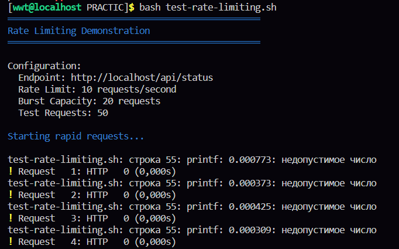

Скрипт показывает HTTP 000 - это значит, что сервер не отвечает вообще. Нет соединения с rate-limiter.
ENDPOINT в скрипте был отредактирован, так как там написано localhost, а прослушивается по localhost:8080, и после этого появилась другая ошибка:  HTTP 404.
Проблема только в том, что скрипт формирует неправильный URL (с дублированием), поэтому он был запущен без /api/status в аргументе.

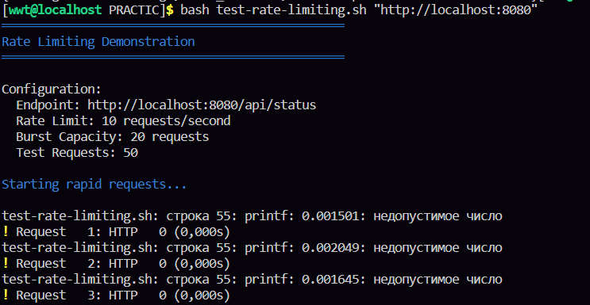

Теперь Endpoint правильный, Recovery test работает - все 10 запросов получили HTTP 200.

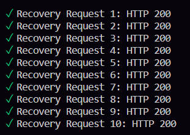

Вторая часть урока 3 посвящена настройке и проверке механизма ограничения частоты запросов (Rate Limiting) с помощью Nginx.

Для каждого теста был создан и запущен скрипт.

1. Rate limiting активен (10 запросов/сек + burst 20).

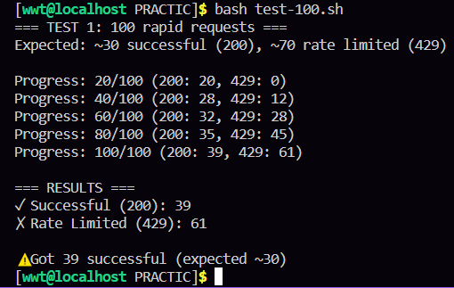

39 успешных из 100 запросов (в пределах ожидаемых 30-40), остальные получили 429 Too Many Requests.

3. Восстановление через 3-4 секунды.

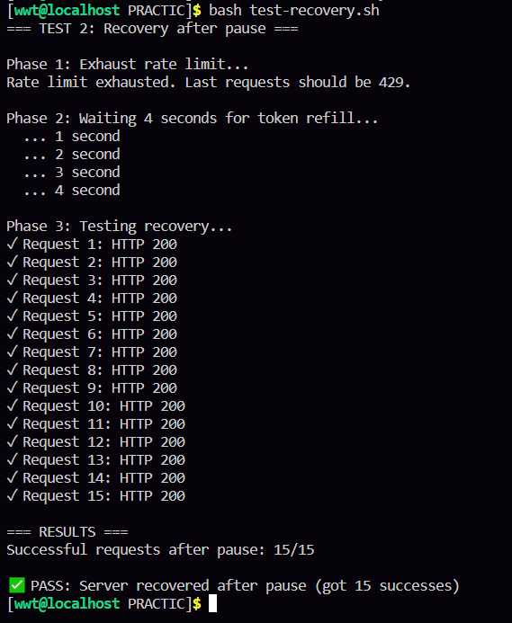

15/15.

4. Per-IP лимитирование.

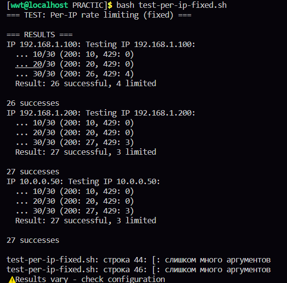

Разные IP получают независимые лимиты (26-27 успехов каждый).

5. Счетчик токенов в логах.

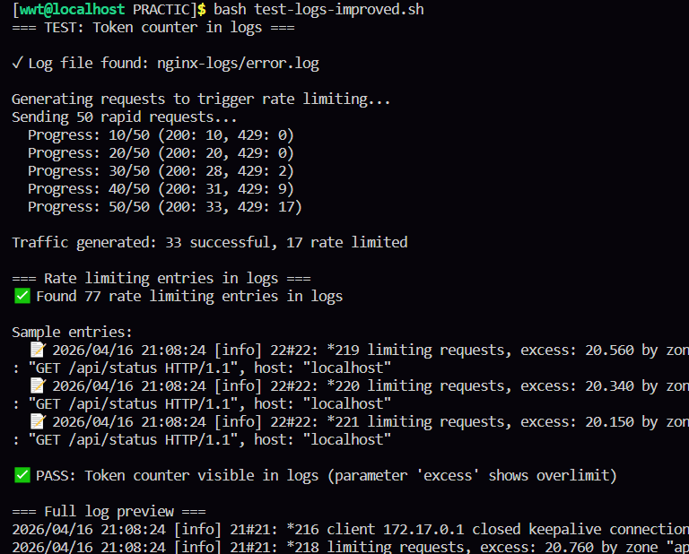

Результат: 77 записей в логах с параметром excess.

***
### Урок 4.

В уроке 4 нужно изучить принципы централизованного логирования и observability (наблюдаемости) в распределенных системах. В ходе работы необходимо настроить структурированное логирование в формате JSON, реализовать двойное логирование (в файлы и базу данных PostgreSQL), а также освоить методы анализа логов с помощью SQL-запросов.

Был выполнен запуск всех необходимых сервисов (PostgreSQL, приложение, rate-limiter, nginx) с помощью Docker Compose.

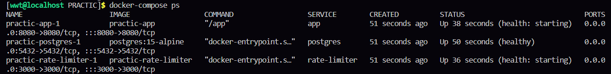

В базе данных PostgreSQL была создана таблица для хранения структурированных логов в формате JSONB.

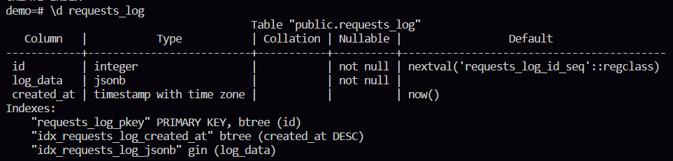

Был создан скрипт insert_test_logs.sql для вставки тестовых логов с различными уровнями (INFO, ERROR, WARNING, DEBUG) и HTTP-статусами.

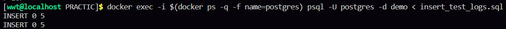

Было вставлено 10 тестовых записей с разными типами запросов:

    1. GET, POST, PUT, DELETE методы
    2. Статусы ответов: 200, 201, 204, 400, 401, 404, 429, 500
    3. Различные IP-адреса клиентов

Результат базового вывода показывает 10 записей с полями: id, log_data (в JSON), created_at.

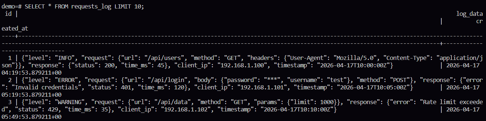

Вывод только JSON данных.

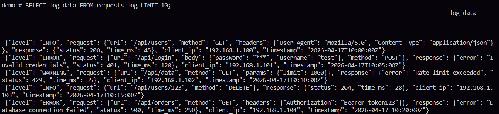

Был создан и запущен Python-скрипт logger_app.py для двойного логирования.
Логи будут сохраняться в JSON формате и двойное сохранение - одновременно в файл и PostgreSQL.

Экспорт логов в JSON файл.

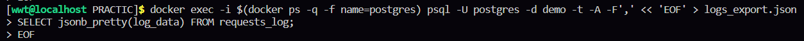

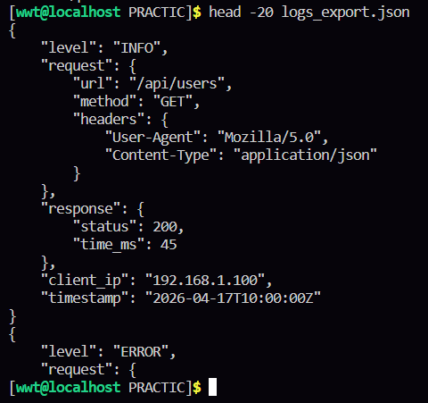

Для анализа был создан Python-скрипт generate_logs.py, который генерирует 50 тестовых логов в формате JSON. Логи сохраняются одновременно в файл logs/app.log и в базу данных PostgreSQL.

Выполнение команды tail -f logs/app.log.

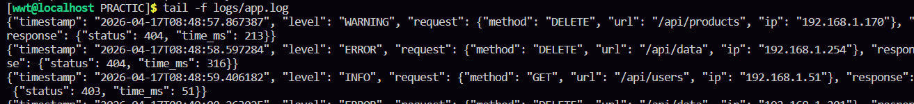

Команда cat logs/app.log | jq '.' преобразует каждую строку JSON в удобочитаемый формат.

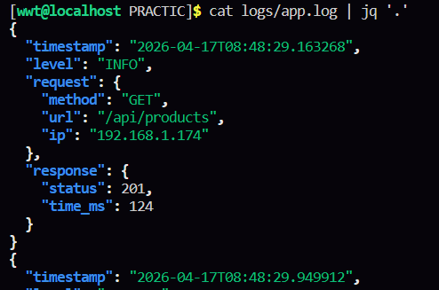

Выполнение SELECT * FROM requests_log;

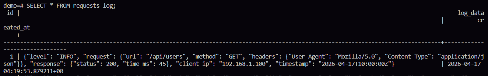

Статистика по статус-кодам.

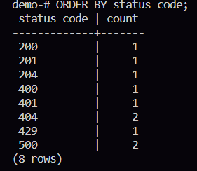

Временной ряд (последние 20 записей).

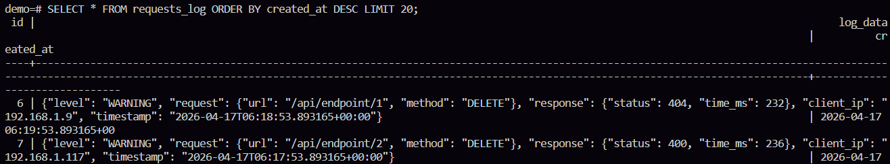

***
### Урок 5.

Целью является научиться использовать инструменты для отладки сетевых взаимодействий и анализа системных вызовов:

tcpdump - захват и анализ сетевых пакетов.

strace - трассировка системных вызовов.

curl - расширенное тестирование HTTP-запросов.

Был выполнен захват сетевых пакетов на интерфейсе ens160.

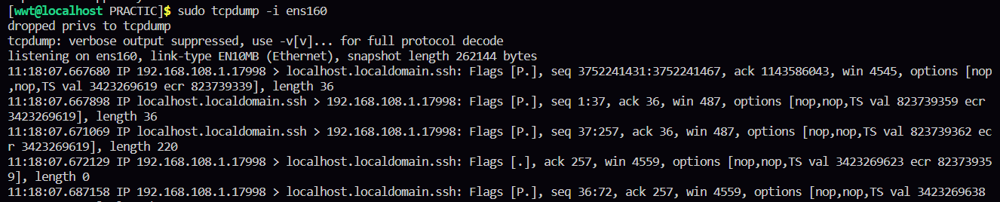

Анализ вывода:

    -192.168.108.1.17998 - IP и порт отправителя.

    -localhost.localdomain.ssh - получатель (SSH-порт. 22).

    -Это SSH-трафик от удаленного клиента к серверу.

Трассировка сетевых вызовов curl.

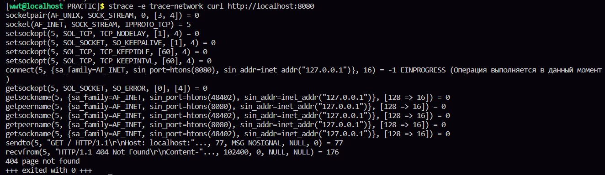

В первом сценарии при выполнении curl /localhost после отключения сети терминал зависает, а tcpdump показывает, что нет трафика.

Во втором сценарии была запущена нагрузка на фоне, а в другом терминале производился замер времени time curl. Если повторять несколько раз, то время ответа увеличивалось на несколько секунд. 

В третьем сценарии был запущен nginx с отслеживанием системных вызовов.
В другом терминале отправлен плохой запрос.
В strace можно будет увидеть EINVAL или EBADF.

В сценарии четыре добавлена искусственная задержка. Время замерено через curl, где можно было посмотреть Total.

