# 1 Nginx (Reverse Proxy)

был установлен докер, докер энжин и докер композ, были подняты контейнеры и health-чек работает. также были успешно выведены логи.
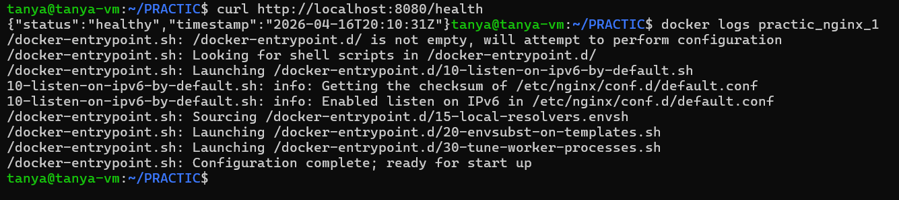

эндпоинты работают 
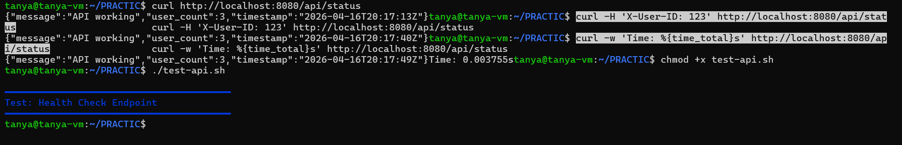

# 2 Docker (безопасность)

скрипт check-docker-security.sh проверяет контейнеры на безопасность, в контейнерах app и nginx он выявил уязвимость - контейнер запускается от рута. чтобы это пофиксить нужно добавить строчку USER username, после этого проверки успешно проходят
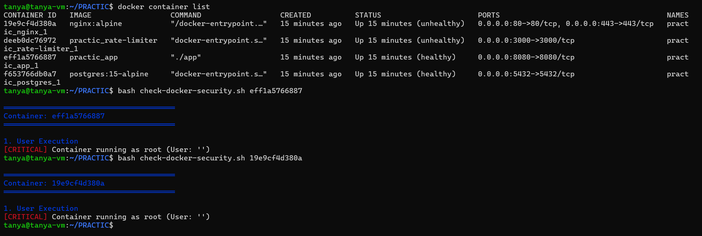

# 3 Rate limiting (Token Bucket)

на берст тесте nginx выдал полный 0, скорее всего проблема в скрипте, а вот после 10 секунд первые 7 запросов прошли, оставшиеся 3 - нет, что странно. написано что recovery тест провалился, хотя по факту, все норм, но на последних чуть чуть отказал. по перформансу - из 100 запросов успешных 25, что примерно и ожидалось. 429 код не возникает (проблема опять таки в кривом нджинксе)
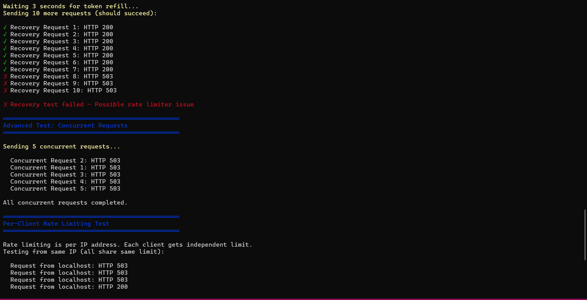

# 4 Логирование и observability 

файла setup-logging.sh нет, печально, зато можно посмотреть логи подключившись к контейнеру с postgresql, подключиться к бд demo с пользователем postgresql, 108 запросов с кодом 200, все работает!
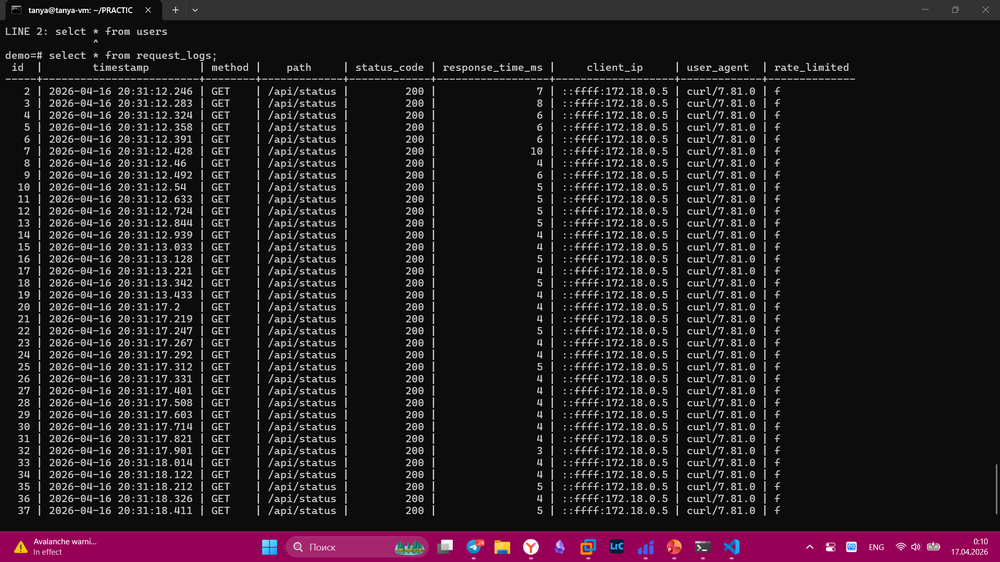
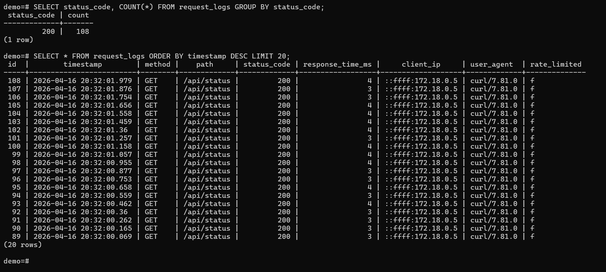

в папке logs есть логи запросов, в формате json
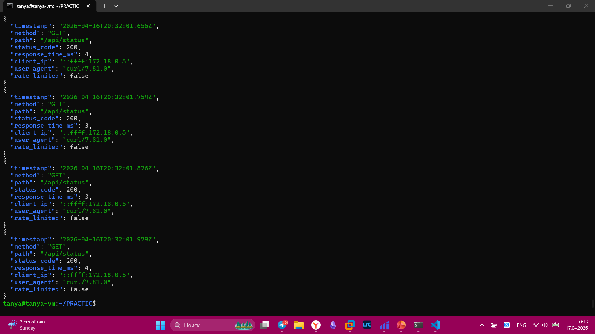

# 5 Отладка и Network Debugging

скрипт по настройке дебаггинга завершился успешно
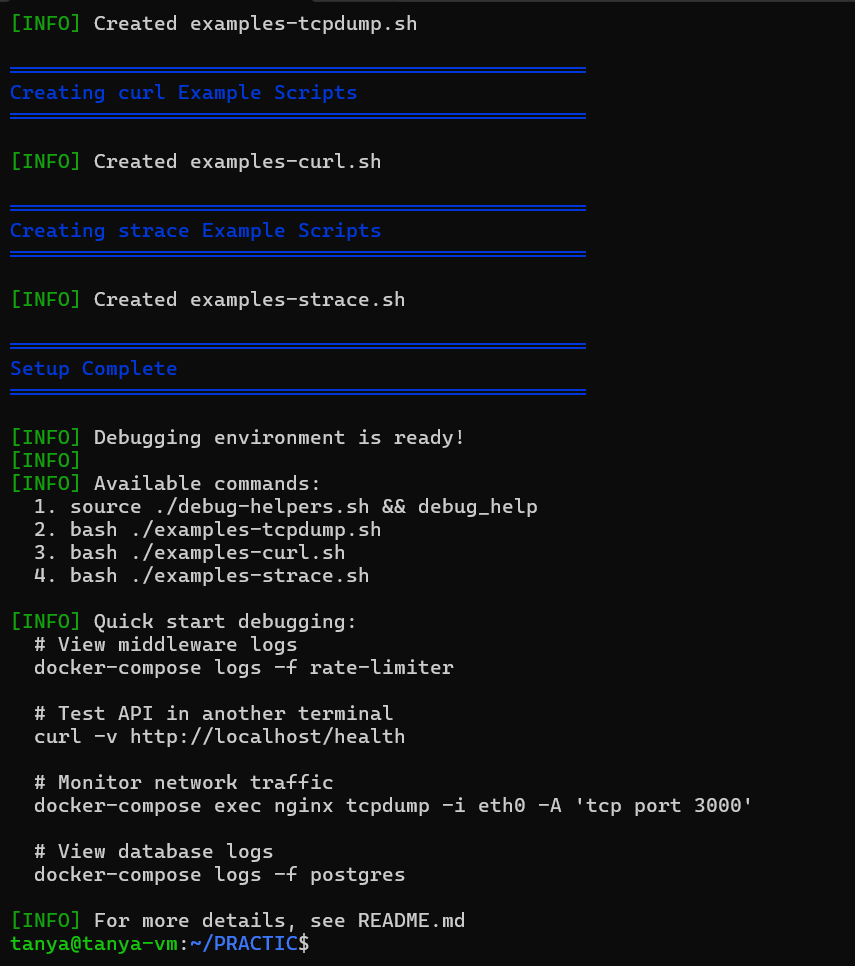

можно, например, ввести просто test_health и отработает скрипт, который проверяет доступность ручки
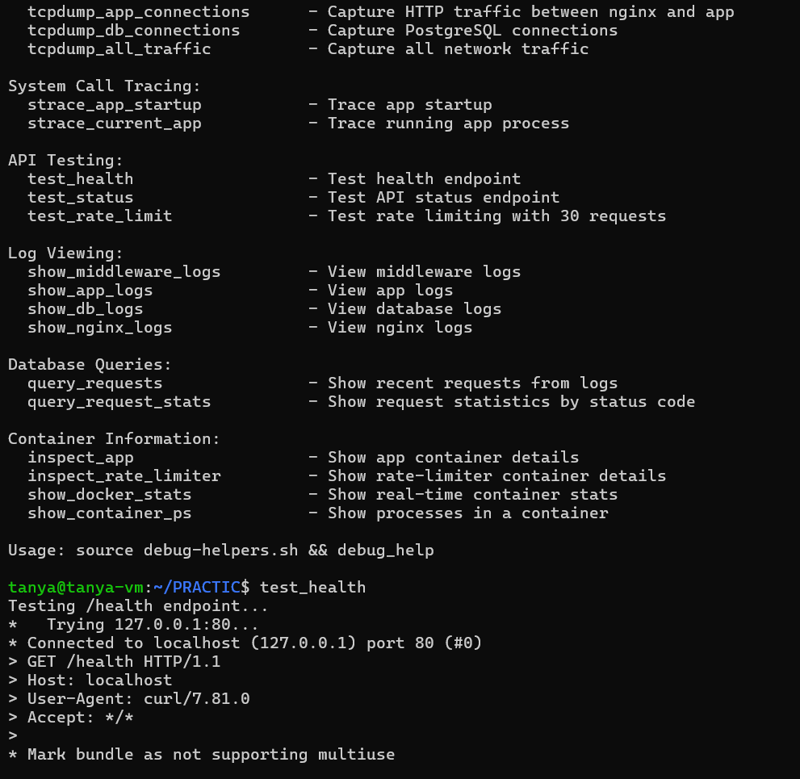

show_db_logs показывает логи базы данных
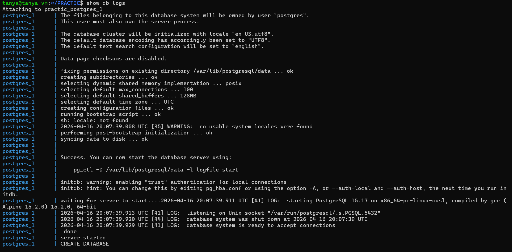

при помощи данной команды можно увидеть полный трассинг запроса
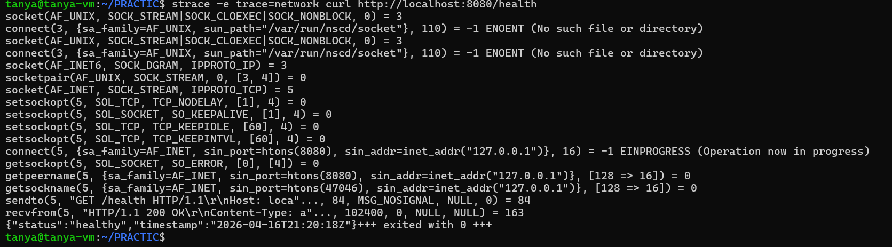

tcpdump позволяет увидеть траффик, который поступает на интерфейсы, в данном случае виден ssh траффик, потому что доступ к вм, на которой выполняется работа выполняется через ssh
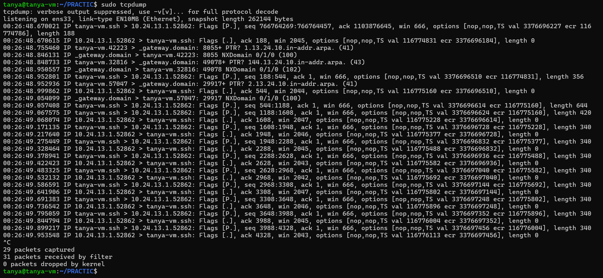

