## Laba SRE Workshop

В данной лабе будет разобраны разные механизмы применямые в работе SRE (Devops) инженеров: Kubernetes troubleshooting, Docker containerization, rate limiting, network debugging, system tracing, and security scanning.

Для начала базово нужно склоинровать репу и перейти в каталог Practic для выполнения скриптов. 

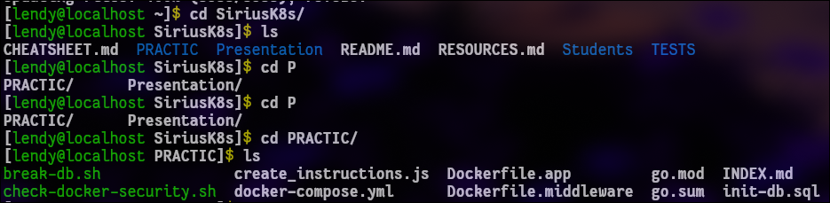

### 1. Start Docker compose

Запускаем компоуз файл, там сидит nginx, база (postgres), app, и rate-limiter. Система сначала пулит образы, потом будет собирать контейнерыЦ

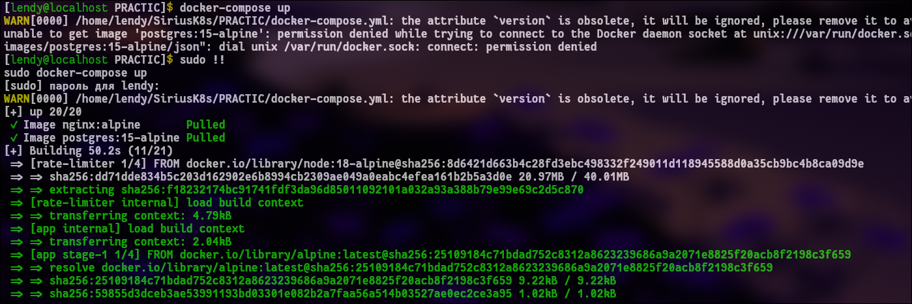

Должно было все забилдится

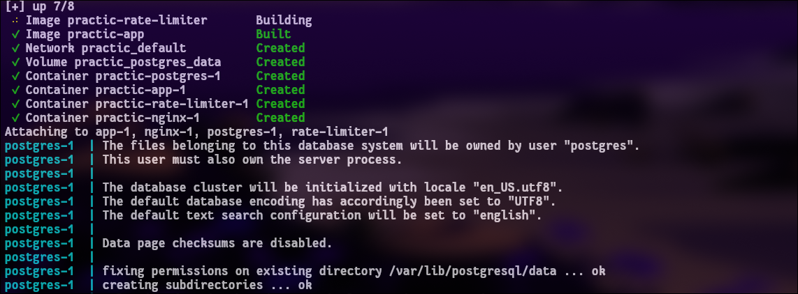

### 2. Nginx (Урок 1)

Глянем ответ от приложухи, проверим, что она жива:

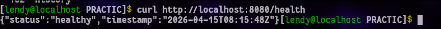

Также проверим API

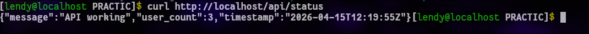

Вроде ок, далее глянем логи nginx

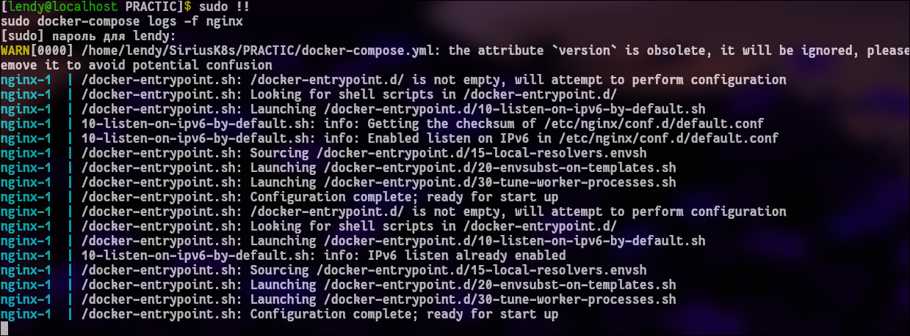

### 3. Запуск скрипта для проверки безопасности контейнеров (Урок 2)

Тестим безопасность контейнеров, которые у нас запущены при помощи даннго скрипта: check-docker-security.sh. Первое, что нам выдает, это то что все контейнеры запускаются от рута, это супер ред флаг. Нужно создавать отдельных юзеров и от них все запускать.

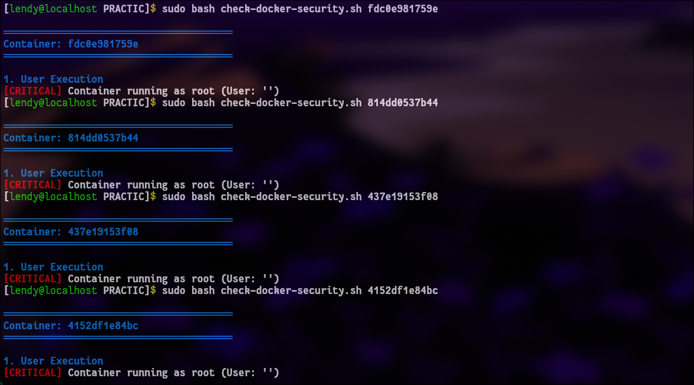

Чтобы это пофиксить нужно добавить в каждый сервис в docker compose строчку user от которого и будет запускаться контейнер, при повторном запуске получим картинку получше

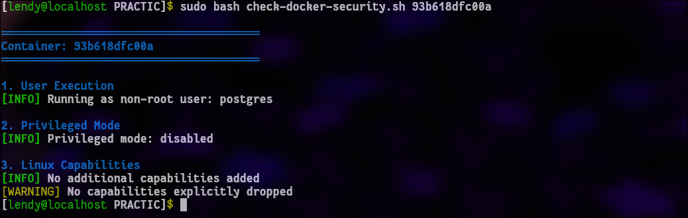

### 4. Запуск нагрузочных скриптов

Проведем нагрузочное тестирование на сервер nginx и получаем плачевную ситуацию где из 50 запросов 9 успешных. Сам nginx скорее всего не умеет возвращать 429 и в целом настроен кривовато.

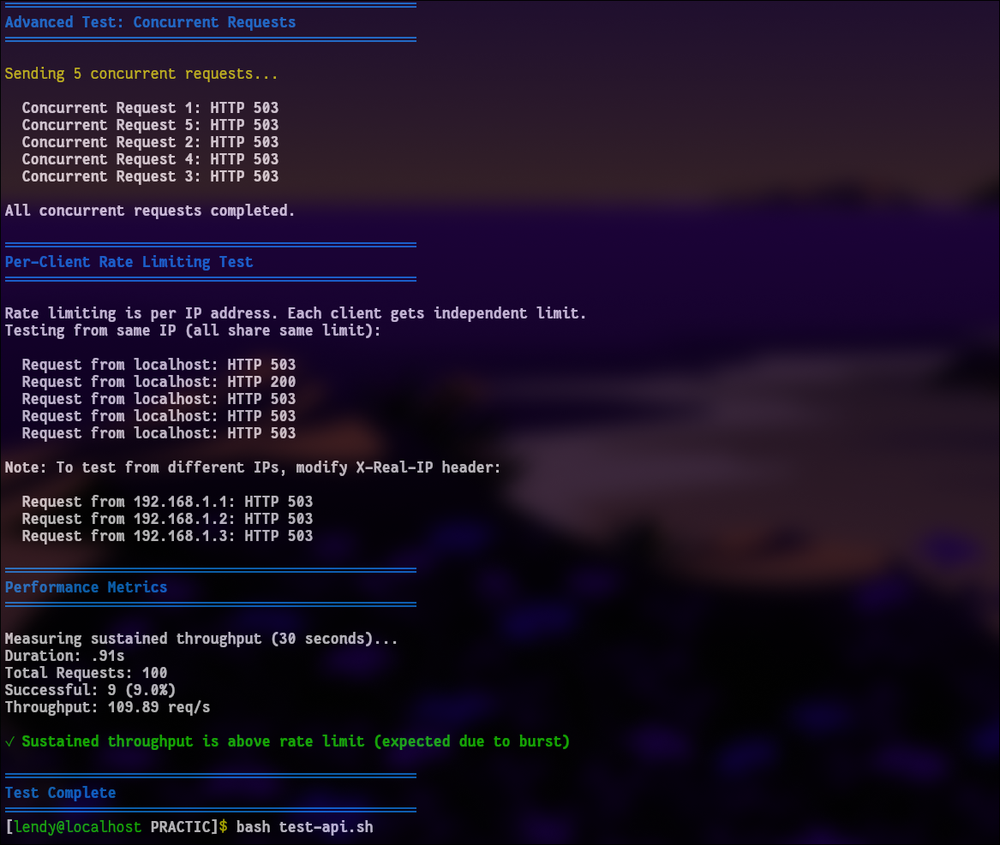

Судя по просмотру конфига nginx /api/ ограничен на 10 r/s с маленьким burst, Nginx режет лишнее как 503, а X-Real-IP в текущем виде не меняет фактический ключ лимита.

То есть скрипт не “сломал” сервер — он просто очень хорошо показал, что конфиг сейчас настроен на жёсткий reject, а не на мягкий 429-rate limiting.

Это можно пофиксить, но по факту конфиг уже почти рабочий, но я бы поправил две вещи: код ответа 429 и корректную обработку реального IP, но можно не делать, в целом и так работает, так что идем дальше

### 5. Тестирования rate-limitr (Урок 3)

Запустим башовым скриптом тесты для проверки лимитов. Как можно заметить после выполнения, первые 6 запросов выполняютс с 200 кодом, далее сервак падает и нам выкидывает 503 (сервис временно недоступен)

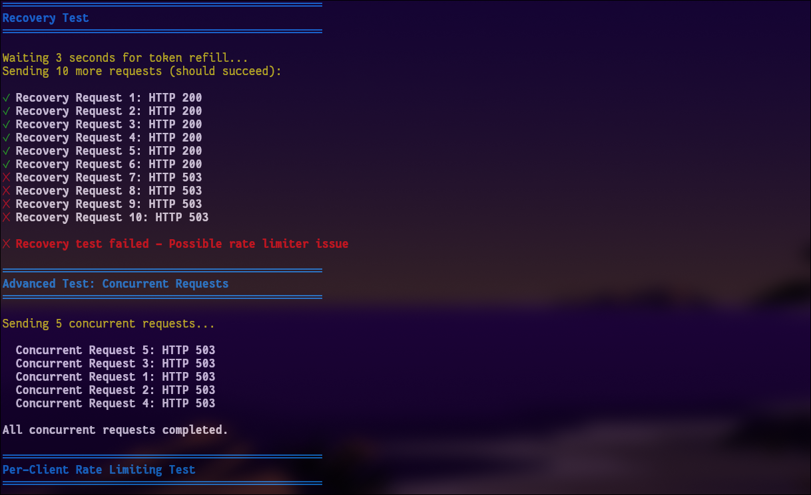

По факту rate limiting работает ок, из за плохого масштабирования приложения будет приколы с недостпуностью сервера.

### 6. Логирование (Урок 4)

По идее тут должен быть пункт с логирование, но данного скрипта в репе нет logging/setup-logging.sh, так что пропускаем. Но если предположить то там скорее всего скрипт связан со сбором метрик с сервисов и отслеживанием их состояния.

Но можно глянуть логи например базы, что там вообще происходит. Рофл в том, что таблица, которая находится в гайде презентации называется по другому))).

Выведим логи, которые есть, там одни 200 ну и хорошо

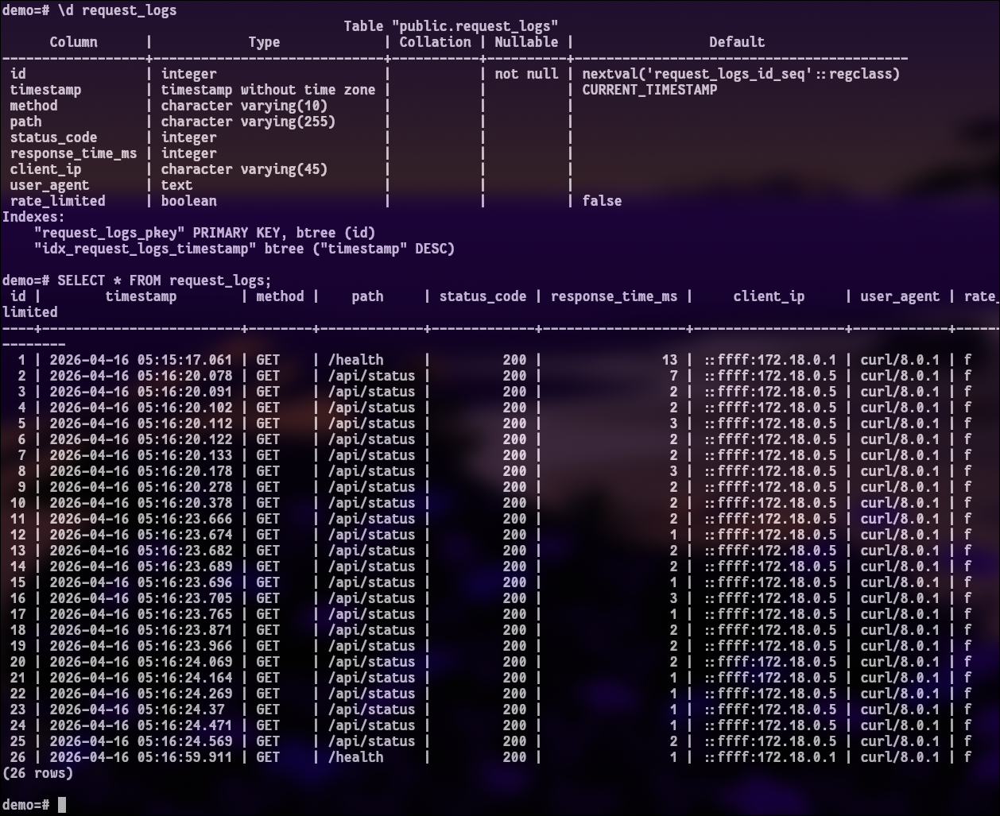

### 7. Отладка и Network Debugging (Урок 5)

Запускаем скриптик **sudo bash setup-debugging.sh** 

Получаем что-то типо такого в консоли

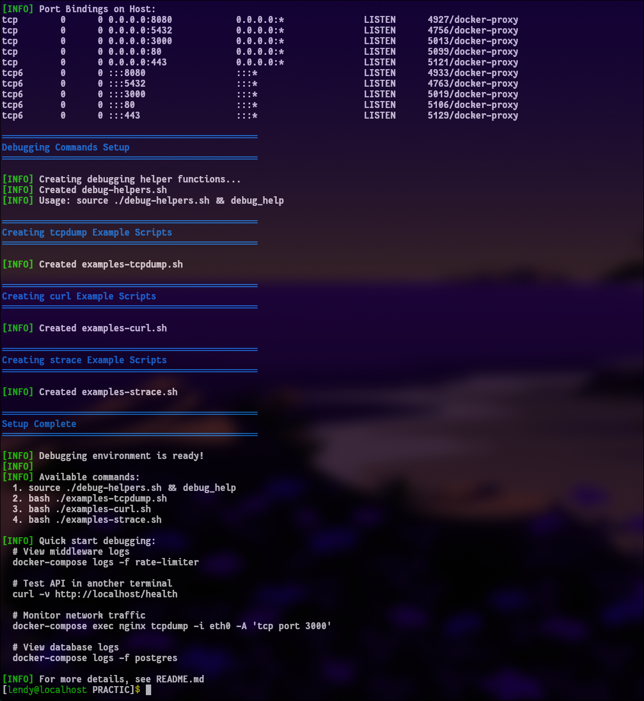

У нас есть ряд команд, которые можно юзать при починки нетворга и в целом для анализа.

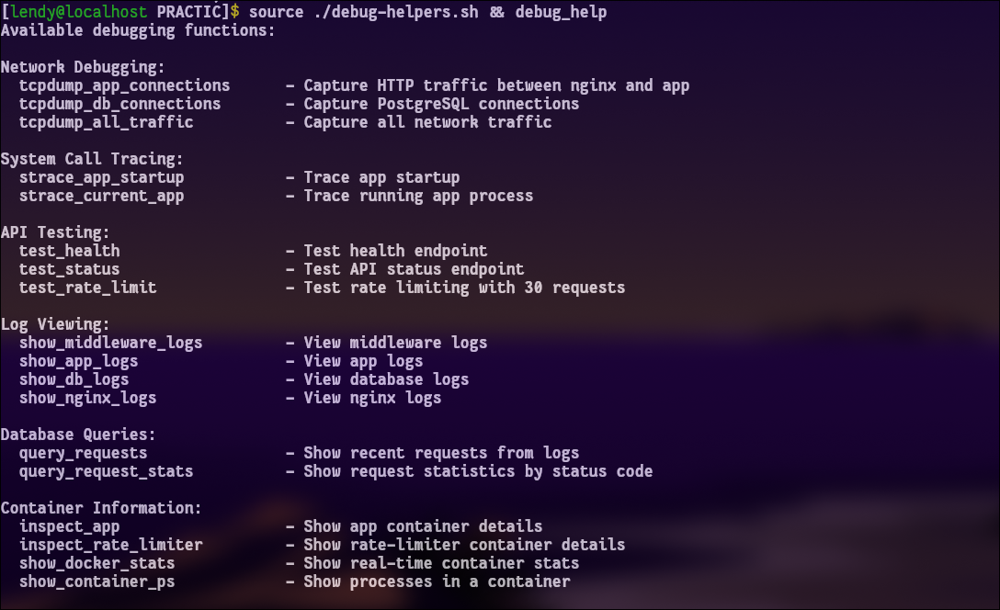

Глянем логи midlware и в целом что локалка жива:

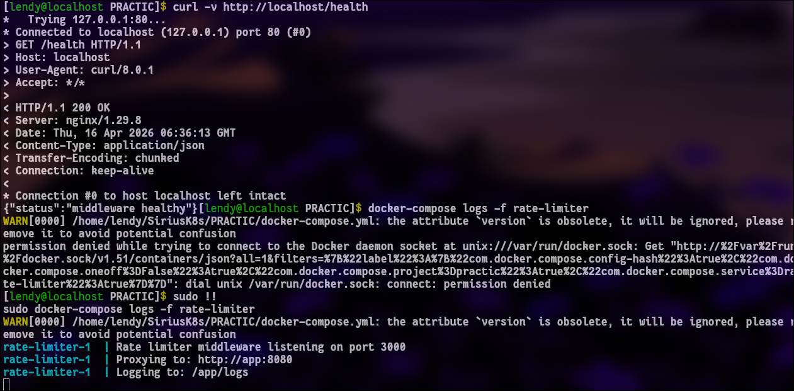

Можно сделать strace. Это утилита, которая позволяеь отслеживать (трассировки) системных вызовов и сигналов, которые процесс отправляет ядру операционной системы.

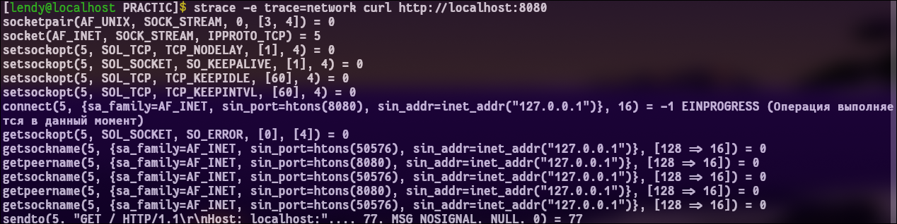

В целом есть куча разных утилит для мониторинга трафика, его отслеживания, по типу tcpdump и так далее.

На этом отчет закончен.