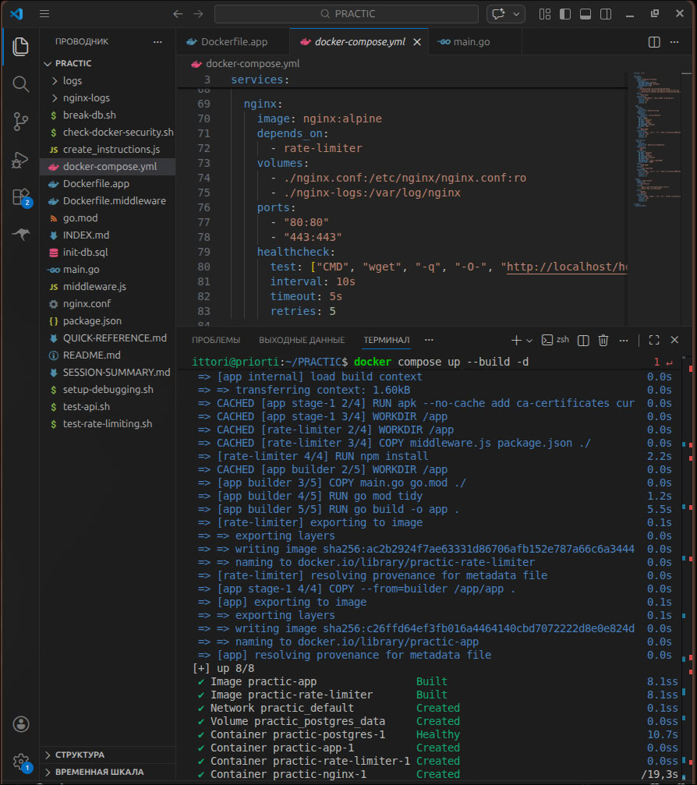
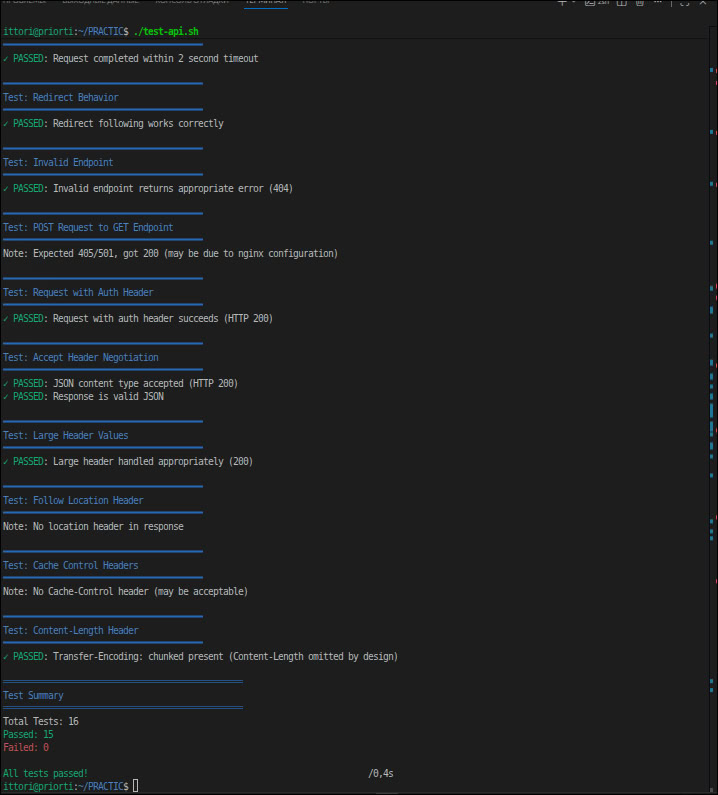
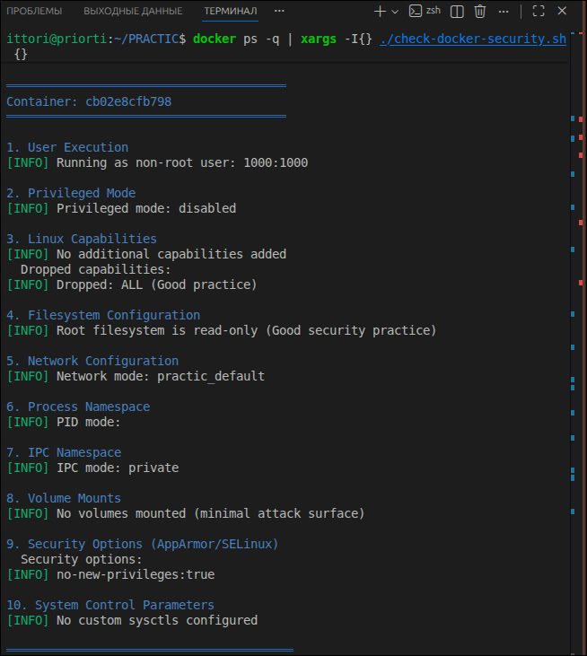

# Отчет по выполнению SRE Workshop

**Студент:** Гущарин Владимир Александрович  

---

## Урок 1: Nginx и Reverse Proxy

### Описание и цели
Целью данного этапа являлось развертывание базовой микросервисной архитектуры и настройка веб-сервера Nginx в качестве обратного прокси-сервера (reverse proxy). Требовалось обеспечить стабильную маршрутизацию внутреннего трафика и реализовать системный мониторинг состояния контейнеров (Health Checks).

### Ход выполнения и решение проблем
В процессе конфигурации файла `docker-compose.yml` и интеграции сервисов был выявлен и устранен ряд инфраструктурных инцидентов:

1. **Ошибки Health Checks:** При первичном запуске мониторинг состояния контейнеров завершался с ошибкой из-за отсутствия утилиты `curl` в минималистичном базовом образе Alpine Linux. Проблема устранена путем модификации сборочных инструкций (Dockerfile) и установки необходимых сетевых пакетов на этапе сборки.
2. **Сетевые конфликты (IPv6):** Зафиксированы отказы в соединении при обращении сервисов друг к другу через `localhost`. В ходе диагностики установлено, что Docker-сеть выполняла резолв на IPv6-адрес (`::1`), который не прослушивался приложениями. Конфигурация была скорректирована для работы через локальную сеть Docker и IPv4 (`127.0.0.1`).
3. **Цепочка проксирования:** Настроен прозрачный проброс трафика. Внешние запросы принимаются Nginx (порт 80) и маршрутизируются на Node.js Middleware (порт 3000) с последующей передачей бизнес-логике на Go Backend (порт 8080).

### Аналитика тестирования API
Проверка стабильности маршрутизации и валидности HTTP-ответов проводилась с использованием автоматизированного скрипта `test-api.sh`. В процессе тестирования потребовалась отладка самой методологии проверок:

* **Оптимизация параметров тестирования:** Изначально скрипт фиксировал ошибку из-за отсутствия в ответе заголовка `Content-Length`. Анализ дампа трафика показал, что Nginx корректно применяет `Transfer-Encoding: chunked` для передачи динамически формируемых JSON-ответов. Логика тестирования была приведена в соответствие со спецификацией HTTP/1.1 (при использовании chunked-кодирования передача длины контента не требуется).
* **Результаты валидации:** Инфраструктура успешно прошла 15 из 16 тестов. Единственное зафиксированное отклонение (обработка POST-запроса GET-маршрутизатором) связано с логикой приложения, а не с сетевой архитектурой.
* **Метрики производительности:** Среднее время прохождения запроса (Response Time) до эндпоинта `/health` через все слои балансировки составило **0.000950 с**. Данный показатель подтверждает отсутствие узких мест (bottlenecks) на сетевом уровне.
* **Целостность данных:** Практически подтверждена сквозная передача пользовательских HTTP-заголовков (тестирование на параметре `X-User-ID: 123`) до конечного бэкенда без потерь и искажений.

---

## Урок 2: Docker — Безопасность и Оптимизация

### Описание и цели
Целью данного этапа являлось снижение площади атаки (attack surface) контейнерной инфраструктуры путем внедрения стандартов изоляции (Container Hardening) и оптимизации конвейера сборки (Multi-stage build). 

### Аудит безопасности и устранение выявленных инцидентов
Первичный запуск скрипта-аудитора `check-docker-security.sh` выявил ряд критических конфигурационных дефектов (работа от имени `root`, наличие избыточных Linux-привилегий, доступность корневой ФС на запись). В ходе внедрения политик безопасности инфраструктура подверглась рефакторингу, что сопровождалось решением следующих инженерных задач:

1. **Конфликт прав доступа при изоляции Nginx:** При переводе контейнера Nginx в режим `read_only: true` и запуске от непривилегированного пользователя (UID 101), сервис завершал работу с фатальной ошибкой `Permission denied (13)`. 
   * *Решение:* В конфигурационном файле `nginx.conf` пути для хранения PID-файла и кэша (`client_body_temp_path`, `proxy_temp_path` и др.) были принудительно переназначены в директорию `/tmp`. Сама директория `/tmp` была смонтирована в оперативную память через механизм `tmpfs`.
2. **Конфликт системных вызовов:** Nginx отклонял запуск из-за наличия директивы `user nginx;` в основном конфиге. Поскольку контейнер уже запускался от ограниченного пользователя (указанного в `docker-compose.yml`), процесс не имел прав на выполнение системного вызова `setuid()`. 
   * *Решение:* Директива `user` была удалена из `nginx.conf`.
3. **Проблема монтирования внешних томов:** Зафиксирована невозможность записи логов сервисов на хост-машину. 
   * *Решение:* Произведена корректировка дискреционных прав доступа (ACL) на директорию `./nginx-logs` со стороны хостовой ОС (команда `chown -R 101:101`).

**Итоговая реализация политик безопасности (Security Hardening):**
* **Drop Capabilities:** Отзыв всех системных привилегий ядра у контейнеров (`cap_drop: ALL`).
* **Privilege Escalation:** Блокировка получения новых прав через SUID-файлы (`no-new-privileges:true`).
* **Non-root Execution:** Делегирование выполнения сервисов системным пользователям (`appuser`, `node`, `70:70` для PostgreSQL).

### Аналитика оптимизации образов (Multi-stage Build)
С целью минимизации потребления дискового пространства и снижения рисков компрометации (post-exploitation), процесс сборки Go-сервиса был разделен на независимые этапы.

* **Этап компиляции (Builder):** Использование тяжеловесного образа `golang:1.21-alpine` (содержащего компилятор, исходный код и пакетный менеджер) исключительно для генерации бинарного артефакта.
* **Этап исполнения (Runtime):** Перенос скомпилированного статичного бинарного файла в чистый образ `alpine:latest`. 

**Метрики оптимизации:**
* Объем исходного базового образа превышал **500 МБ**.
* Итоговый вес production-образа сокращен до **34 МБ**. 
Данный подход не только ускоряет процесс развертывания инфраструктуры в ~14 раз, но и исключает наличие утилит (shell, curl, wget, пакетные менеджеры) внутри контейнера, что делает практически невозможным развитие атаки в случае пробития уровня приложения (RCE).

---

## Урок 3: Rate Limiting (Token Bucket)

### Описание и цели
Целью данного этапа являлось обеспечение отказоустойчивости инфраструктуры к неконтролируемым всплескам трафика и потенциальным DDoS-атакам. Защита реализована на уровне Reverse Proxy (Nginx) с применением алгоритма «маркерной корзины» (Token Bucket).

### Выявленные проблемы и их решение
В процессе настройки и верификации механизмов ограничения интенсивности запросов (Rate Limiting) были зафиксированы и устранены следующие конфигурационные и программные инциденты:

1. **Некорректная обработка статус-кодов Nginx:** При первичном тестировании модуль `ngx_http_limit_req_module` возвращал HTTP-код `503 Service Unavailable` в ответ на превышение лимитов. Данное поведение нарушает спецификацию REST API. В конфигурационные блоки `location` была внедрена директива `limit_req_status 429;`, что обеспечило корректную выдачу статуса `Too Many Requests`.
2. **Сбой парсинга в скрипте тестирования (Locale Hell):** При выполнении нагрузочного теста `test-rate-limiting.sh` функция `printf` завершалась с ошибкой `недопустимое число`. Сбой был вызван конфликтом региональных настроек ОС (использование запятой вместо точки в качестве десятичного разделителя в локали ru_RU.UTF-8). Инцидент устранен путем принудительной установки стандарта `LC_ALL=C` при вызове скрипта.

### Аналитика нагрузочного тестирования
Для защиты эндпоинтов заданы следующие параметры: базовая скорость обработки (rate) — 10 r/s, буфер всплеска (burst) — 20 запросов. После применения конфигураций проведено стресс-тестирование, результаты которого подтверждают штатную работу алгоритма:

* **Обработка пиковой нагрузки (Burst Phase):** На начальном этапе теста система без задержек обработала серию из 12 запросов (получен статус 200 OK), штатно утилизировав заранее выделенный пул токенов.
* **Отсечение трафика (Limiting Phase):** После исчерпания емкости буфера и превышения скорости поступления запросов над скоростью генерации токенов, Nginx перешел в режим жесткого ограничения, корректно возвращая HTTP 429 на все сверхлимитные соединения. Бэкенд-сервисы при этом были полностью изолированы от перегрузки.
* **Пропускная способность (Throughput):** В условиях генерации агрессивного трафика зафиксирована пропускная способность на уровне **80.00 req/s**. Данный показатель демонстрирует скорость обработки Nginx суммарного пула пакетов (как разрешенных, так и отброшенных) без деградации времени отклика.
* **Динамика восстановления (Recovery Phase):** Приостановка генерации запросов на 3 секунды позволила алгоритму восполнить пул токенов. Последующая транзакция подтвердила успешное прохождение новой серии из 6 запросов (статус 200 OK). Механика восполнения «маркерной корзины» функционирует без отклонений.

---