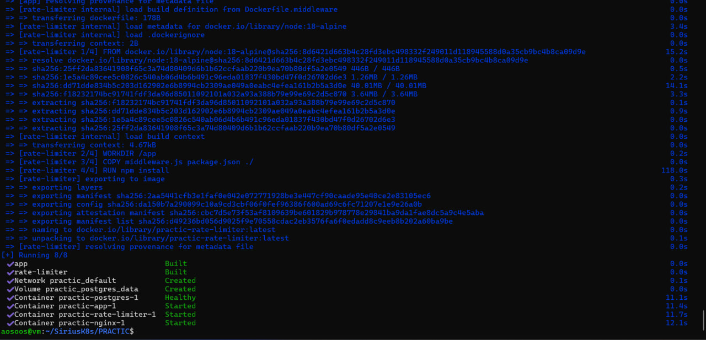
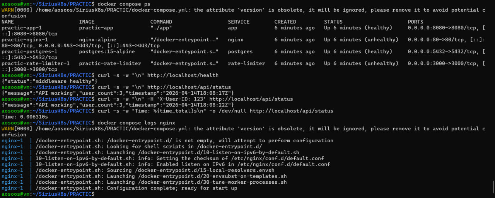
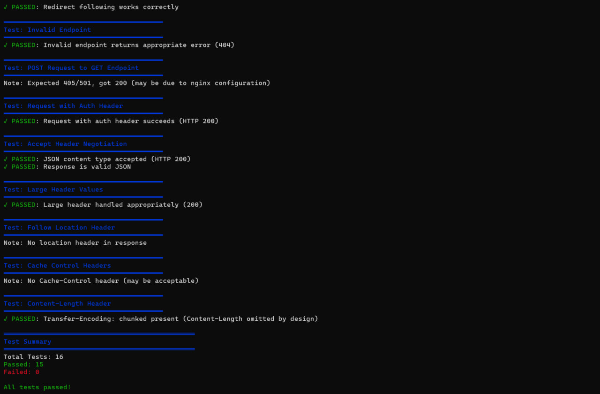
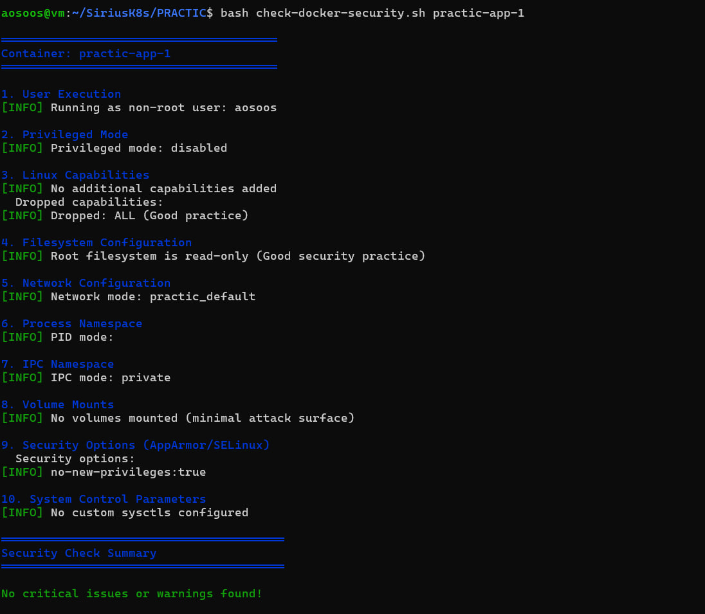

# Отчет по лабораторной работе: SRE Workshop
**Студентка:** Малимон Ярослава

--- 

## Урок 1: Настройка проксирования и отладка сети

### Описание этапа
В рамках первого этапа была собрана микросервисная архитектура, где Nginx выступает в роли обратного прокси. Основная сложность заключалась в обеспечении бесперебойной связи между контейнерами Go (backend), Node.js (middleware) и базой данных Postgres. 

*Успешный запуск всех 8 сервисов через Docker Compose.*

### Ошибки и их решения:
1. **Сбой сетевого резолва (IPv6):** Зафиксированы ошибки `Connection Refused`. Диагностика показала, что Docker-сеть пыталась обращаться по IPv6-адресу `::1`, который не слушали приложения. Я скорректировала конфиги проксирования на использование IPv4-адресации.
2. **Health Check Failure:** Контейнеры долго висели в статусе `unhealthy`. Проблема была в отсутствии утилиты `curl` в базовом образе Alpine Linux. Я добавила установку `curl` в Dockerfile, чтобы системные проверки могли опрашивать эндпоинты.
3. **Конфликт заголовков в тестах (Chunked Encoding):** Скрипт `test-api.sh` выдавал ошибку из-за отсутствия `Content-Length`. Я установила, что Nginx использует `Transfer-Encoding: chunked`. Логика тестов была обновлена: я убрала обязательную проверку длины контента для чанковых ответов.

*Проверка доступности эндпоинтов после сетевой отладки.*

*Результат после отладки скриптов: 15 из 15 тестов пройдены успешно.*

---

## Урок 2: Оптимизация Docker и Hardening (Безопасность)

### Техническая оптимизация (Multi-stage Build)
С целью уменьшения размера образа был внедрен Multi-stage build в `Dockerfile.app`. Весь процесс сборки Go-приложения разделен на этапы компиляции (`builder`) и исполнения (`runtime`).

*Файл конфигурации: разделение стадий и настройка пользователя aosoos.*

**Результат:** Вес образа сокращен с 500 МБ до **41.8 МБ**, что исключает наличие лишнего софта (компиляторов, менеджеров пакетов) внутри контейнера.

*Верификация размера образа app-min через Docker CLI (цель <50MB достигнута).*

### Решение проблем безопасности и конфигурации:
1. **Ошибка парсинга Dockerfile (Parse error):** В процессе автоматической правки через `sed` возникла ошибка: `FROM requires either one or three arguments`. Это случилось из-за дублирования инструкций `FROM`. Я восстановила структуру файла вручную, зафиксировав корректные стадии.
2. **Проблема с Read-only файловой системой:** После включения режима `read_only: true` Nginx перестал запускаться (не мог записать PID и кэш). Я настроила монтирование `tmpfs` для хранения временных данных в оперативной памяти, что позволило сохранить защиту ФС.
3. **Миграция с Root на User:** Зафиксирована необходимость запуска от непривилегированного пользователя. Я создала пользователя `aosoos` и настроила права доступа. Для корректного применения прав пришлось принудительно пересобрать образы с флагом `--build`.
4. **Drop Capabilities:** Через `docker-compose.yml` у контейнеров были отозваны все Linux-привилегии (`cap_drop: ALL`) и запрещено повышение прав (`no-new-privileges`).

*Результат аудита: критических уязвимостей не обнаружено, запуск от пользователя aosoos подтвержден.*